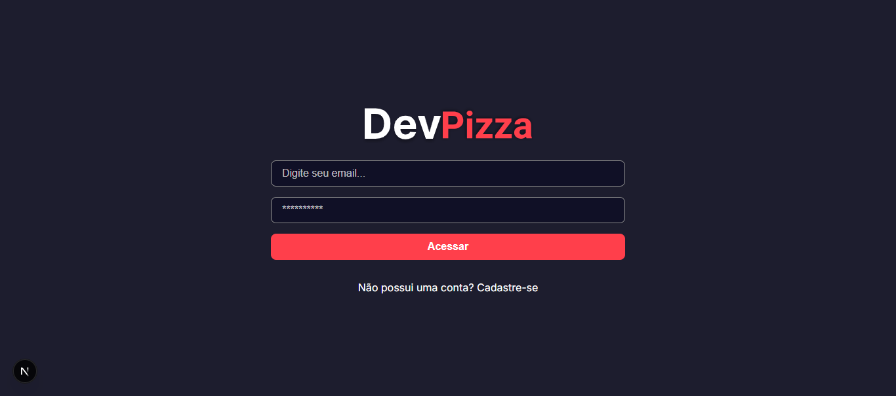
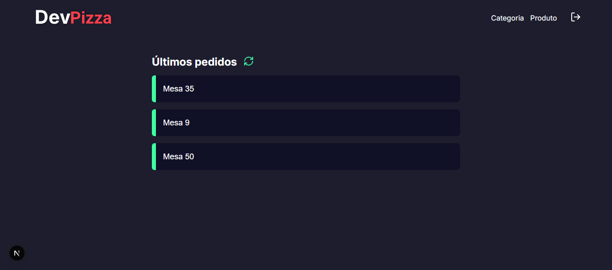
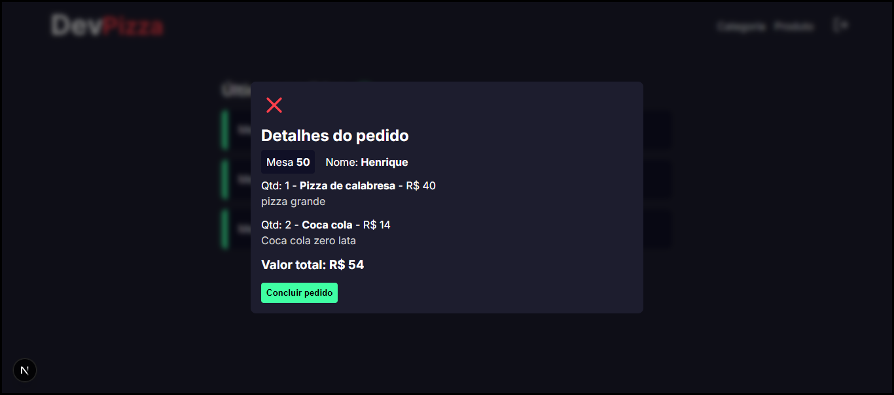
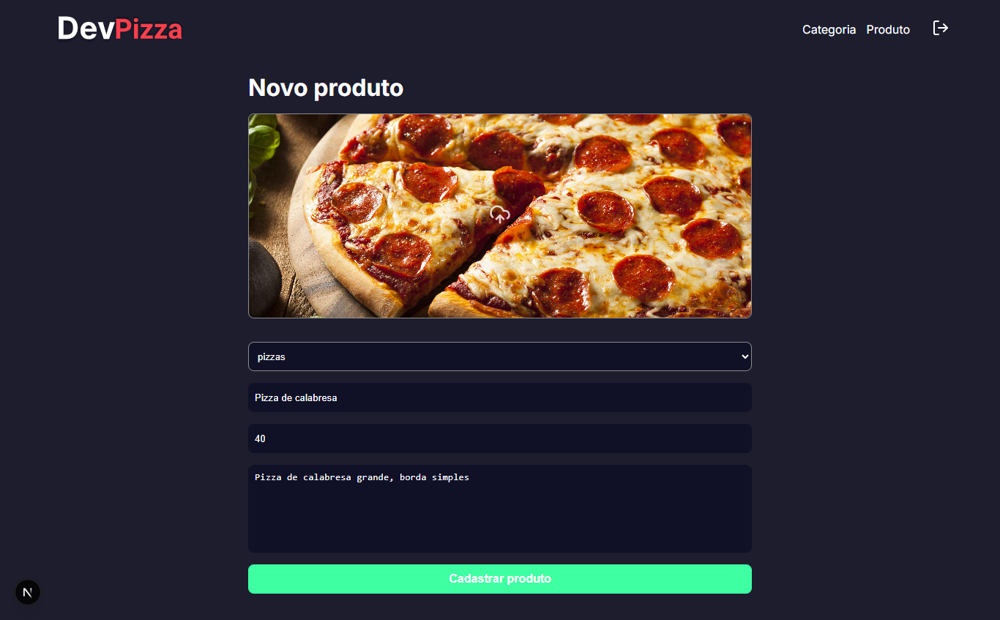

<div style="display: flex; flex-direction: column; text-align: center;">
    <h1>DevPizza - Sistema de Pizzaria</h1>
</div>

## Sumário

- [\[pizzaria-frontend\]](#)
  - [Sumário](#sumário)
  - [Introdução](#introdução)
  - [Descrição Geral](#Descrição-Geral)
  - [Tecnologias Usadas](#tecnologias-usadas)
  - [Principais Funcionalidades](#pricipais-funcionalidades)
  - [Snapshots](#snapshots)
  - [Como Executar o Projeto](#como-executar-o-projeto)
  - [Links Úteis](#links-úteis)
  - [Contato](#contato)

## Introdução

Este é um projeto de sistema de Pizzaria, com objetivo principal de organizar e falicitar o atendimento aos clientes e recebimento de pedidos da cozinha. Este repositório de destina somente ao frontend do projeto e para funcionar é necessário executar o [backend](https://github.com/vgab1/devpizza-backend).

## Descrição Geral

O **Sujeito Pizza** é um sistema completo para pizzarias, onde:
- **Garçons** usam um aplicativo mobile para realizar pedidos e gerenciar atendimentos.
- **Cozinha** usa uma interface web para visualizar e preparar os pedidos.
- **Backend** gerencia toda a lógica de negócios, incluindo pedidos, produtos, autenticação e integração com serviços externos (como Cloudinary para upload de imagens).

Este repositório é dedicado ao frontend, desenvolvido em **NextJS com TypeScript** e hospedado na **Vercel**.

## Tecnologias Usadas

&nbsp;
&nbsp;


- **Linguagem**: TypeScript
- **Framework**: Next 14
- **Ferramentas de Desenvolvimento**:
  - Utilizado a bibilioteca [cookie-next](https://www.npmjs.com/package/cookies-next) para sessão;
  - Requisições feitas com Axios;
  - Utilizado Sass para estilização;
  - Utilizado [Sonner](https://www.npmjs.com/package/sonner) para mostrar toasts;
  - lucide-react (icons)
  - contextAPI

## Pricipais funcionalidades

### 1. **Produtos e Categorias**
- **Criar produtos**: Os cozinheiros podem cadastrar produtos seguintos as categorias cadastrar e definir o seu preço, descriação e fotos.
- **Criar categorias**: Os cozinheiros podem cadastar novas categorias que serão exibidas no aplicativo mobile e como opção de cadastro dos protutos.
- **Finalizar pedido**: Após o preparo, a cozinha pode concluir o pedido e tirar da fila.

### 2. **Autenticação e Cadastro**
- Autenticação de usuários realizada no backend da aplicação.
- Proteção de rotas com middleware de autenticação usando o cookie-next.
- Cadastro de novos usuários


## Snapshots

### Home



### Pedidos recebidos



### Detalhes do pedido



### Cadastro de produtos



## Como Executar o Projeto

### Pré-requisitos

- Virtual Studio Code - Version 1.97.2
- Node.js - Version 22.11.0

Para executar o projeto é preciso estar com o ambiente [backend](https://github.com/vgab1/devpizza-backend) configurado localmente ou hospedado em alguma plataforma como a vercel.

1. Clone o repositório:
  ```bash
  git clone https://github.com/vgab1/devpizza-frontend
  cd devpizza-frontend
  ```

2. Instale as dependências:
  ```bash
  npm install
  ```

3. Crie o arquivo *.env* na raiz do projeto e configure as variáveis de ambiente, conforme abaixo.
  ```javascript
  NEXT_PUBLIC_API=http:// localhost:3000 ou a url do seu projeto backend
  ```

4. Execute o comando:
  ```bash
  npm run dev
  ```

5. Feito! O projeto deve ser iniciado e pode ser acessado usando um navegador web pelo **localhost** ou a **url de hospodagem** do seu projeto.

## Links Úteis

- Repositório do Backend: [https://github.com/vgab1/devpizza-backend](https://github.com/vgab1/devpizza-backend)

## Contato

Para obter mais informações, entre em contato comigo em:

- Email: dev.vgab1@gmail.com
- GitHub: https://github.com/vgab1